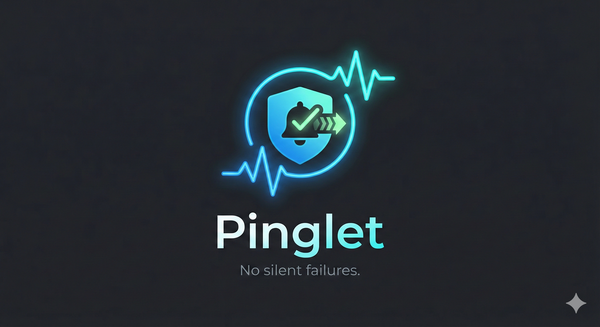

<p align="center">
  
</p>

# Pinglet

> **This repository has moved to [github.com/servosity/pinglet](https://github.com/servosity/pinglet)**

A universal task wrapper for macOS that guarantees no silent failures. Wraps scheduled tasks with unified logging, state tracking, and alerts (Slack + macOS).

## What's a Pinglet?

A **pinglet** is an individual scheduled task managed by Pinglet. Each pinglet wraps a command with reliability features — retries, state tracking, alerting, and missed-run detection. Examples: the UCE link collector is a pinglet, Obsidian git-sync is a pinglet, the daily health check is a pinglet.

Think of it like pods in Kubernetes or containers in Docker — "pinglet" is the unit noun for a scheduled task-agent in this system.

---

## Agent Instructions

Run `--help` for the full CLI reference in one call:

```bash
/path/to/pinglet/venv/bin/python /path/to/pinglet/pinglet.py --help
```

All management commands output JSON to stdout. Parse `ok` field for success/failure.

### Quick Reference

```bash
P="/path/to/pinglet/venv/bin/python /path/to/pinglet/pinglet.py"

# List all tasks (JSON)
$P --list --json

# Full task details + state + recent logs (one call)
$P --task-show <id>

# Add a task
$P --task-add <id> --command /path/to/exe --args arg1 arg2 --name "Display Name" --schedule-spec "daily 7:00" --timeout 300

# Set/change schedule
$P --schedule <id> "every 1h"

# Enable scheduling (generates plist + loads LaunchAgent)
$P --task-enable <id>

# Edit a task (only specified fields update)
$P --task-edit <id> --timeout 600

# Disable scheduling (unloads LaunchAgent)
$P --task-disable <id>

# Remove task entirely (auto-disables if scheduled)
$P --task-remove <id>

# View task logs
$P --task-logs <id> 100

# Preview any change without modifying
$P --task-add test --command /usr/bin/echo --dry-run
```

### Schedule Syntax

| Format | Example | Result |
|--------|---------|--------|
| Interval | `every 1h`, `every 30m`, `every 3600s` | StartInterval |
| Daily | `daily 7:00` | 7:00 AM daily |
| Multi-daily | `daily 7:00,19:00` | 7 AM and 7 PM |
| Weekly | `weekly mon 7:33` | Monday at 7:33 AM |

### Output Format

```json
{"ok": true, "task_id": "...", "config": {...}}
{"ok": false, "error": "Task not found"}
```

Exit codes: `0` = success, `1` = error, `2` = validation error.

### Workflow: Add + Schedule + Enable

```bash
$P --task-add my-task --command /usr/bin/python3 --args script.py --schedule-spec "daily 7:00"
$P --task-enable my-task
```

### Workflow: Debug a Failing Task

```bash
$P --task-show my-task    # config + state + recent logs in one call
$P --task-logs my-task 200  # more log lines if needed
```

---

## Features

- **Pinglet Management CLI**: Add, edit, remove, enable, disable pinglets — all via CLI with JSON output
- **Reliability System**: Automatic retry with exponential backoff, consecutive failure thresholds, alert cooldown
- **Missed Pinglet Detection**: Hourly heartbeat detects pinglets that couldn't run (laptop asleep, etc.)
- **Actionable Notifications**: macOS notifications with Run/Ignore buttons, Slack messages
- **Output Formatting**: Per-pinglet output parsing for rich notification summaries (JSON/text)
- **Pinglet Queue**: Sequential execution with configurable gaps between pinglets
- **Monitoring Self-Protection**: Every CLI invocation checks if watchdog agents are alive; surviving agents detect and alert when monitoring is down ("who watches the watchmen")
- **LaunchAgent Health Detection**: Real-time `launchctl` status checks detect disabled (exit 78), failed, and not-loaded agents — not just plist existence
- **Escalation Tiers**: Staleness alerts escalate from warning (2x threshold) to urgent (5x) to critical (10x)

## Quick Start

```bash
# Run a pinglet
./venv/bin/python pinglet.py --task uce

# List all pinglets (includes LaunchAgent status + warnings)
./venv/bin/python pinglet.py --list

# List all pinglets (JSON)
./venv/bin/python pinglet.py --list --json

# Show full pinglet details + logs
./venv/bin/python pinglet.py --task-show uce

# Run health check
./venv/bin/python pinglet.py --healthcheck

# Test alerts
./venv/bin/python pinglet.py --test-alerts
```

## Adding a New Pinglet

```bash
# Add task with schedule
./venv/bin/python pinglet.py --task-add my-task \
  --command /path/to/venv/bin/python \
  --args script.py --flag \
  --working-dir /path/to/project \
  --name "My Task" \
  --timeout 300 \
  --schedule-spec "daily 7:00"

# Enable it (generates LaunchAgent plist + loads it)
./venv/bin/python pinglet.py --task-enable my-task

# Verify
./venv/bin/python pinglet.py --task-show my-task
```

### Available Config Flags

| Flag | Required | Default | Description |
|------|----------|---------|-------------|
| `--command` | Yes | - | Executable path |
| `--name` | No | Title-cased ID | Display name for notifications |
| `--args` | No | [] | Command arguments |
| `--working-dir` | No | Command's directory | Working directory |
| `--timeout` | No | 300 | Timeout in seconds |
| `--env` | No | [] | Env vars to pass through |
| `--output-format` | No | text | Output format (text/json) |
| `--summary-template` | No | null | Template for JSON output |
| `--failures-before-alert` | No | 3 | Consecutive failures before alerting |
| `--schedule-spec` | No | null | Schedule (see syntax above) |

## Editing and Removing Pinglets

```bash
# Edit (only specified fields update)
./venv/bin/python pinglet.py --task-edit my-task --timeout 600

# Change schedule
./venv/bin/python pinglet.py --schedule my-task "every 2h"
./venv/bin/python pinglet.py --task-enable my-task  # reload with new schedule

# Disable (keeps config, removes LaunchAgent)
./venv/bin/python pinglet.py --task-disable my-task

# Remove entirely (auto-disables + removes config + state)
./venv/bin/python pinglet.py --task-remove my-task

# Preview any change first
./venv/bin/python pinglet.py --task-remove my-task --dry-run
```

## Monitoring & Self-Protection

### LaunchAgent Status Detection

`--list` and `--healthcheck` now query `launchctl` directly for real agent state instead of just checking if the plist file exists. This catches agents that launchd has disabled (exit code 78) — a common failure mode after reboot or macOS updates.

Statuses: `RUNNING`, `IDLE` (loaded, waiting for schedule), `DISABLED` (exit 78), `FAILED`, `NOT_LOADED`, `NOT_INSTALLED`.

### Who Watches the Watchmen

Every CLI invocation checks if the healthcheck and heartbeat monitoring agents are alive. If they're dead, a warning prints to stderr. After any successful task run, a debounced Slack alert fires (24h cooldown) so monitoring failures don't go unnoticed.

### Escalation Tiers

Staleness alerts escalate based on how far past the threshold a task is:

| Multiplier | Level | Example (2h threshold) |
|------------|-------|------------------------|
| 2x | Warning | 4h since last run |
| 5x | Urgent | 10h since last run |
| 10x | Critical | 20h since last run |

### Plist Hardening

Generated plists include `KeepAlive > SuccessfulExit: false` so launchd restarts agents that exit non-zero instead of permanently disabling them. The heartbeat agent uses `KeepAlive: true` for maximum resilience.

## Missed Pinglet Detection

Pinglet detects when scheduled pinglets haven't run (e.g., laptop was asleep) and notifies with actionable options.

### Install Heartbeat

```bash
./venv/bin/python pinglet.py --install-heartbeat
./venv/bin/python pinglet.py --uninstall-heartbeat
```

### How It Works

1. Heartbeat runs hourly via LaunchAgent
2. Checks each pinglet's `last_run` against `healthcheck.expected_intervals`
3. Checks `launchctl` for disabled/failed agents
4. For missed pinglets, sends macOS notification with Run/Ignore buttons
5. For disabled agents, sends urgent Slack alert with fix commands
6. Also sends Slack message with escalation level (warning/urgent/critical)
7. 30-second wake delay allows system to stabilize after wake

### Manual Commands

```bash
./venv/bin/python pinglet.py --heartbeat       # Run check now
./venv/bin/python pinglet.py --run-now uce     # Run a missed task
./venv/bin/python pinglet.py --ignore uce      # Ignore until next run
```

## Output Formatting

Pinglets can configure custom output formatters for rich notification summaries.

### Text Format (Default)

Shows last 5 lines of stdout, truncated to 200 characters.

### JSON Format

Parses stdout as JSON and applies template string substitution.

```yaml
tasks:
  obsidian-tab-archiver:
    output:
      format: json
      summary_template: "Archived {tabs_archived} tabs, kept {tabs_kept}"
```

With stdout `{"tabs_archived": 12, "tabs_kept": 8}`, the notification shows: `Archived 12 tabs, kept 8`

## CLI Reference

### Task Management

| Command | Description |
|---------|-------------|
| `--task-add <id>` | Add a new task |
| `--task-edit <id>` | Edit an existing task |
| `--task-remove <id>` | Remove a task (auto-disables) |
| `--task-show <id>` | Full details + state + logs (JSON) |
| `--task-logs <id> [N]` | Last N lines of task logs |
| `--task-enable <id>` | Generate plist + load LaunchAgent |
| `--task-disable <id>` | Unload + remove plist |
| `--schedule <id> <spec>` | Set task schedule |
| `--list [--json]` | List all tasks (includes LaunchAgent status) |
| `--dry-run` | Preview changes |

### Task Execution

| Command | Description |
|---------|-------------|
| `--task <name>`, `-t` | Run a registered task |
| `--run-now <task>` | Run a missed task immediately |
| `--ignore <task>` | Mark a missed task as ignored |
| `--healthcheck`, `-H` | Run daily health summary (checks launchd status) |
| `--heartbeat` | Run heartbeat check (detects disabled agents) |
| `--test-alerts` | Test notification system |
| `--install-heartbeat` | Install heartbeat LaunchAgent |
| `--uninstall-heartbeat` | Uninstall heartbeat LaunchAgent |

## Configuration Reference

### Notifications

```yaml
notifications:
  on_success: false
  on_failure: true
  slack_enabled: true
  macos_enabled: true
  success_silent: true
  manual_complete_silent: true
```

### Reliability System

Reduces alert fatigue by:
1. **Automatic retry** with exponential backoff (10s -> 60s -> 300s)
2. **Consecutive failure threshold** - only alert after N failures
3. **Alert cooldown** - don't spam if task keeps failing
4. **Recovery notifications** - notify when task recovers

```yaml
reliability:
  retry:
    max_attempts: 3
    delays_seconds: [10, 60, 300]
    jitter: 0.25
  alert:
    consecutive_failures: 3
    cooldown_minutes: 30
  notify_on_recovery: true
```

### Choosing `consecutive_failures` Threshold

| Threshold | Use Case |
|-----------|----------|
| 1 | Critical/infrequent tasks |
| 2-3 | Important tasks with occasional transient failures |
| 3-5 | Frequent tasks where transient failures are common |
| 5+ | Very frequent tasks with known flakiness |

### Heartbeat

```yaml
heartbeat:
  enabled: true
  interval_minutes: 60
  wake_delay_seconds: 30

healthcheck:
  expected_intervals:
    uce: 14
    git-sync: 2
```

## Project Structure

```
pinglet/
├── pinglet.py              # Main entry point + CLI + watchdog self-check
├── config.yaml             # Task registry and configuration
├── lib/
│   ├── task_manager.py     # Pinglet CRUD, schedule parsing, plist generation, launchd status
│   ├── alerts.py           # Slack + macOS notifications + critical monitoring alerts
│   ├── reliability.py      # Retry, threshold, cooldown logic
│   ├── state.py            # Pinglet state tracking (JSON)
│   ├── logging.py          # Structured logging
│   ├── heartbeat.py        # Missed pinglet detection + disabled agent detection + escalation
│   ├── ignored.py          # Ignored pinglets management
│   ├── queue.py            # Pinglet queue for sequential execution
│   └── output_formatter.py # Output formatting (JSON/text)
├── tests/                  # Test suite (175 tests)
├── state/                  # Per-task state files (*.json)
├── logs/                   # Log files
└── launchagents/           # Generated LaunchAgent plists
```

## Troubleshooting

```bash
# Show full task debug info (config + state + launchd status + logs)
./venv/bin/python pinglet.py --task-show <task-id>

# View recent logs for a task
./venv/bin/python pinglet.py --task-logs <task-id> 100

# Test a task manually
./venv/bin/python pinglet.py --task <task-id>

# Check LaunchAgent status (shows disabled agents with exit 78)
./venv/bin/python pinglet.py --list

# Raw launchctl status
launchctl list | grep pinglet

# Re-enable a disabled agent
./venv/bin/python pinglet.py --task-enable <task-id>

# Run tests
./venv/bin/python -m pytest tests/ -v
```
